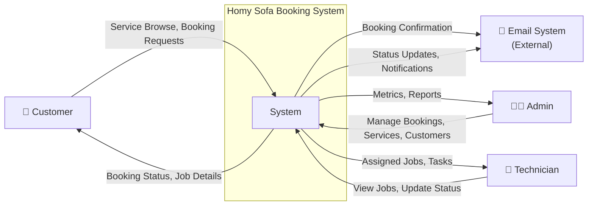
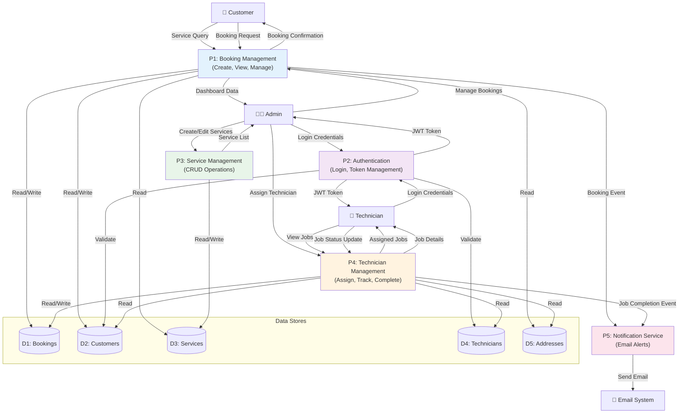
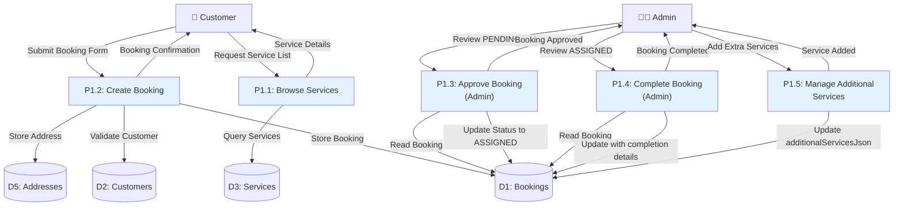
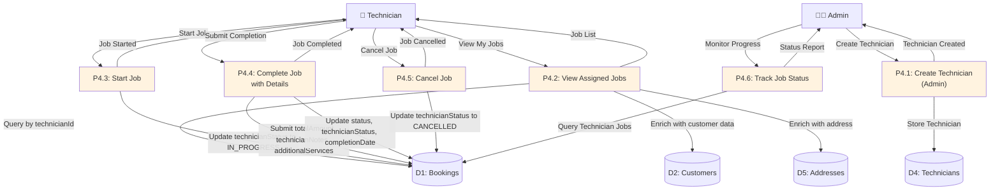
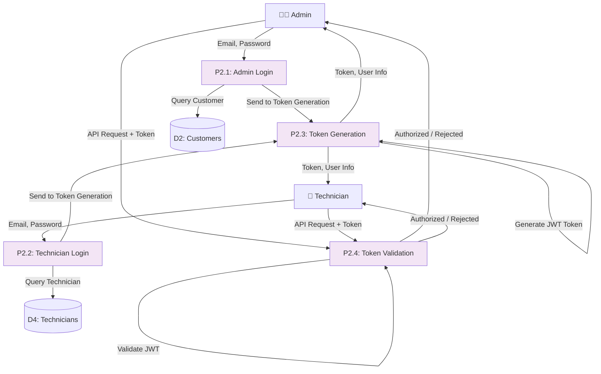

# Data Flow Diagram (DFD) — Homy Sofa Booking System

Comprehensive DFD documentation covering Level 0 (Context), Level 1 (Major Processes), and Level 2 (Detailed Processes).

---

## Level 0: Context Diagram

The context diagram shows the Homy Sofa system as a single process with all external actors and main data flows.

### Level 0 Actors & Data Flows

| Actor | Sends | Receives |
|-------|-------|----------|
| **Customer** | Service queries, Booking requests, Address/contact info | Booking confirmation, Status updates |
| **Admin** | Service CRUD, Booking approvals/completions, Technician assignments | Dashboard metrics, Booking list, Customer data, Payment records |
| **Technician** | Job status updates (start, complete, cancel), Completion notes, Additional services | Assigned jobs, Job details, Customer/address info |
| **Email System** | Receives notification requests | Sends confirmation/status emails |

---

## Level 1: Major Processes

Level 1 decomposes the system into key processes:

### Level 1 Processes

| Process | Input | Output | Functions |
|---------|-------|--------|-----------|
| **P1: Booking Mgmt** | Booking requests, Browse queries | Booking confirmation, Booking list, Status updates | Create, view, filter bookings; add services |
| **P2: Authentication** | Login credentials (email, password) | JWT token, User session | Admin & Technician login; token validation |
| **P3: Service Mgmt** | Service CRUD operations | Service list, Service details | Create, read, update, delete services |
| **P4: Technician Mgmt** | Job assignments, Status updates | Assigned jobs, Job metrics | Assign jobs, track progress, handle completions |
| **P5: Notification** | Booking/Job events | Email notifications sent | Send confirmation, status change, and completion emails |

### Level 1 Data Stores

| Store | Purpose | Fields |
|-------|---------|--------|
| **D1: Bookings** | Booking records | id, customerId, service, date, status, technicianId, technicianStatus, completionDate, technicianNotes, additionalServicesJson |
| **D2: Customers** | Customer profiles | id, name, email, phone, address, totalBookings, totalSpent |
| **D3: Services** | Available services | id, name, description, price, category, duration, features, imageUrl |
| **D4: Technicians** | Technician profiles | id, name, email, phone, password, serviceCategory, isActive |
| **D5: Addresses** | Booking addresses | id, bookingId, customerId, addressText, latLong |

---

## Level 2: Detailed Processes

### Level 2a: Booking Management (Decomposition of P1)

### Level 2b: Technician Management (Decomposition of P4)

### Level 2c: Authentication (Decomposition of P2)

---

## Key Data Flows Summary

### Customer Journey
1. **Browse** → Query services (P1.1) → Service list
2. **Create Booking** → Submit form (P1.2) → Create booking + address + customer
3. **Confirmation** → Email notification (P5)
4. **Track Status** → View booking status in real-time

### Admin Journey
1. **Login** → Credentials (P2.1) → JWT token
2. **Manage Bookings** → View all, filter, approve/complete (P1.3, P1.4)
3. **Assign Technician** → Select technician during approval (P4.1 via P1.3)
4. **Add Services** → Append additional services to booking (P1.5)
5. **Dashboard** → Metrics, reports, customer analytics

### Technician Journey
1. **Login** → Credentials (P2.2) → JWT token
2. **View Jobs** → Query assigned jobs (P4.2) → Job list with customer/address
3. **Start Job** → Mark IN_PROGRESS (P4.3)
4. **Complete Job** → Submit completion details, add services (P4.4)
5. **Notifications** → Receive email on assignment and completion (P5)

---

## Technical Notes

### Data Store Implementation
- **D1–D5** map to MySQL tables: `bookings`, `customers`, `services`, `technicians`, `addresses`.
- **Booking fields** include: `status` (PENDING/ASSIGNED/COMPLETED/CANCELLED), `technicianId`, `technicianStatus` (ASSIGNED/IN_PROGRESS/COMPLETED/CANCELLED), `technicianNotes`, `additionalServicesJson`.

### Process Implementation
- **P1–P5** correspond to Spring Boot controllers/services and Angular services.
- **P2** uses JWT; tokens stored in `localStorage` on frontend; sent in `Authorization` header.
- **P5** uses `EmailService` (Spring Boot) to send async notifications.

### Security & Authentication
- Admin and Technician roles enforced by guards (`AdminGuard`, `TechnicianGuard`).
- JWT tokens validated on every protected request.
- Passwords hashed via `PasswordEncoder` (BCrypt).

---

## Diagram Export

For interactive diagrams, view this file in:
- **GitHub Markdown** (native Mermaid rendering)
- **VS Code** with Mermaid Preview extension
- **mermaid.live** (paste Mermaid blocks)

To export to PNG/SVG:
1. Open [mermaid.live](https://mermaid.live)
2. Paste any diagram block
3. Click "Download" to export as PNG/SVG
