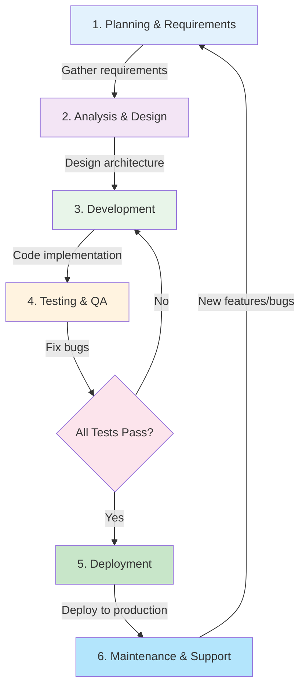
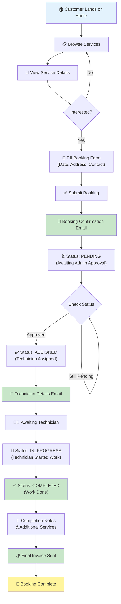
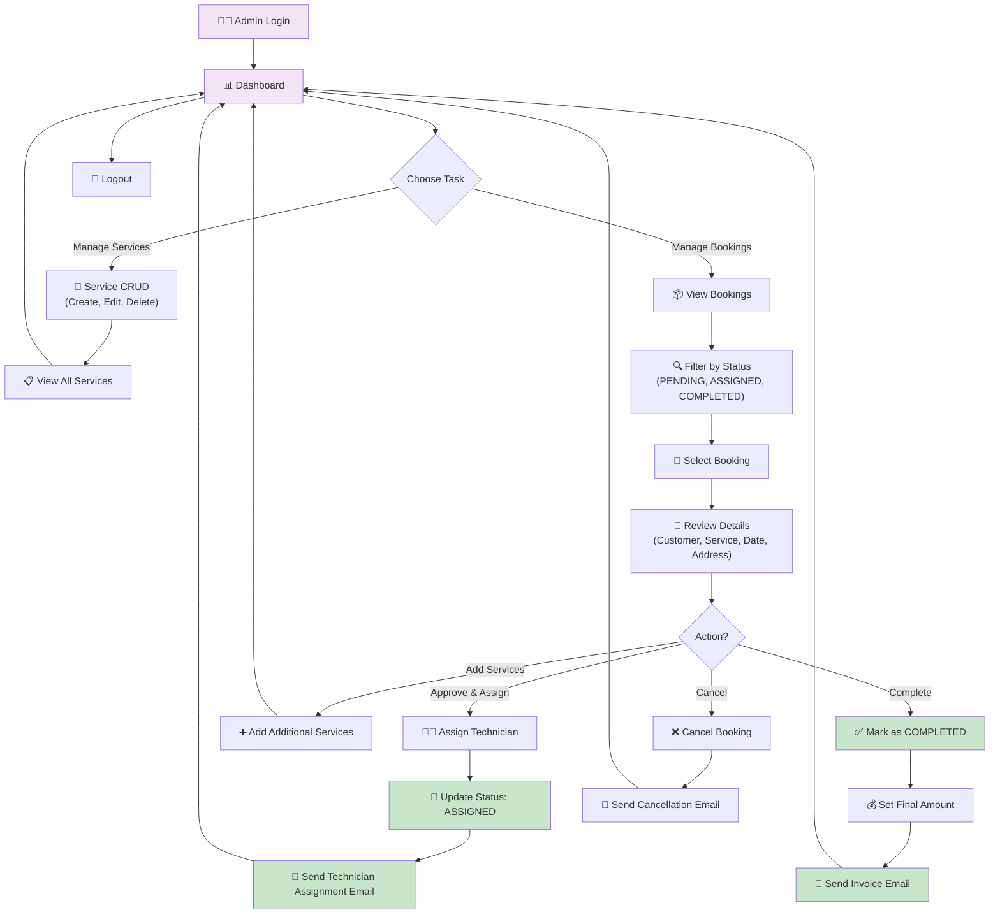
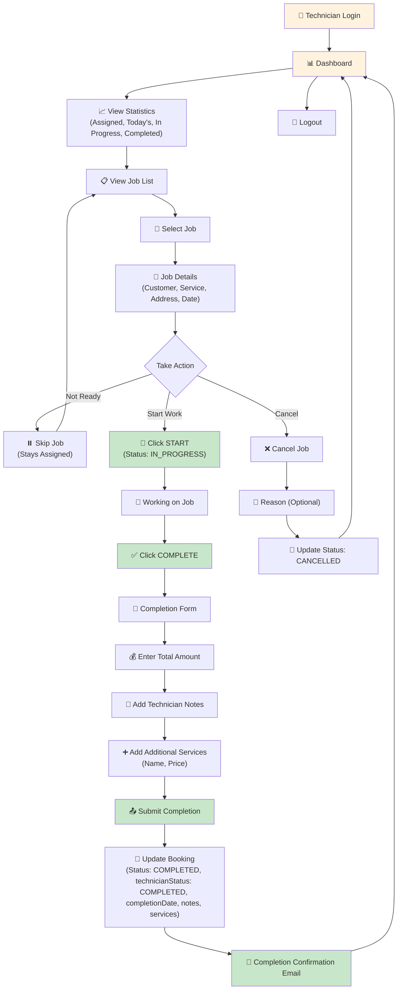
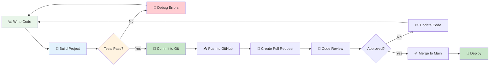

# Software Development Life Cycle (SDLC) — Homy Sofa Booking System

Comprehensive documentation of the SDLC phases followed for the Homy Sofa project, including phase diagrams, user flows, and development workflow.

---

## SDLC Phases Flowchart

The Homy Sofa project follows a structured **6-phase SDLC model**:



---

## SDLC Phase Details

### Phase 1: Planning & Requirements
**Duration**: Initial project kickoff  
**Key Activities**:
- Define project scope (booking platform for Homy Sofa)
- Identify stakeholders (customers, admins, technicians)
- Gather functional requirements (booking, payment, service management)
- Identify non-functional requirements (security, performance, scalability)

**Deliverables**:
- Project Charter
- Requirements Document
- Stakeholder Analysis

---

### Phase 2: Analysis & Design
**Duration**: Architecture & system design  
**Key Activities**:
- Design system architecture (Angular SPA + Spring Boot backend)
- Create DFD (Data Flow Diagrams) Level 0, 1, 2
- Define database schema (Bookings, Customers, Services, Technicians, Addresses)
- Design UI/UX mockups (user, admin, technician dashboards)
- Plan security (JWT authentication, role-based access control)

**Deliverables**:
- Architecture Diagram
- Database Schema
- UI/UX Mockups
- Security Design Document
- DFD Documentation

---

### Phase 3: Development
**Duration**: Code implementation  
**Key Activities**:
- **Backend Development** (Spring Boot, Java 17):
  - BookingController, BookingService, BookingRepository
  - AuthenticationService with JWT
  - TechnicianController, TechnicianService
  - EmailService for notifications
  - Models: Booking, Customer, Service, Technician, Address

- **Frontend Development** (Angular 15):
  - User module (home, services, booking, contact)
  - Admin module (dashboard, manage-services, manage-bookings)
  - Technician module (login, dashboard, jobs, completion)
  - Shared components (navbar, footer, Material UI)
  - Services: AuthService, BookingService, TechnicianService

- **Database Setup**:
  - MySQL schema creation
  - JPA entity mapping
  - Data relationships

**Deliverables**:
- Backend source code
- Frontend source code
- Database migrations
- API documentation

---

### Phase 4: Testing & QA
**Duration**: Validation and bug fixing  
**Key Activities**:
- **Unit Testing**: Test individual components and services
- **Integration Testing**: Test API endpoints and database interactions
- **System Testing**: End-to-end user flows (booking, admin approval, technician job)
- **User Acceptance Testing (UAT)**: Verify requirements are met
- **Bug Fixes**: Resolve TypeScript errors, Material imports, API issues

**Current Status**:
- Frontend: `ng serve` exit code 1 (compilation/module errors)
- Backend: `./mvnw spring-boot:run` exit code 1 (type/port issues)
- **Actions Needed**: Resolve build errors before deployment

**Deliverables**:
- Test Cases
- Bug Reports
- Test Summary Report

---

### Phase 5: Deployment
**Duration**: Release to production  
**Key Activities**:
- Build Docker images (frontend Dockerfile, backend Dockerfile)
- Set up containerization (docker-compose.yml)
- Deploy to cloud (Azure Container Apps / AKS / App Service)
- Configure CI/CD pipeline (GitHub Actions)
- Set up monitoring & logging

**Current Status**:
- Dockerfiles created for frontend and backend
- Ready for containerization planning
- Pending: Full deployment to production environment

**Deliverables**:
- Docker images
- Deployment scripts
- Environment configuration
- CI/CD pipeline

---

### Phase 6: Maintenance & Support
**Duration**: Post-deployment ongoing support  
**Key Activities**:
- Monitor system performance
- Fix production bugs
- Implement feature enhancements
- Update documentation
- User support and training

**Current Status**:
- Technician feature added (enhancement)
- PROJECT_FUNCTIONALITY.md updated
- DFD.md created
- SDLC.md documentation (this file)

---

## Project Timeline

```mermaid
gantt
  title Homy Sofa SDLC Timeline
  dateFormat YYYY-MM-DD
  
  Planning :p1, 2025-10-01, 30d
  Analysis & Design :p2, after p1, 30d
  Development (Phase 1 - Core) :p3a, after p2, 60d
  Development (Phase 2 - Technician) :p3b, after p3a, 30d
  Testing & QA :p4, after p3b, 45d
  Deployment Prep :p5, after p4, 15d
  Maintenance & Support :p6, after p5, 60d
  
  %% Milestones
  milestone Req Complete, milestone, after p1, 1d
  milestone Design Complete, milestone, after p2, 1d
  milestone Core Dev Done, milestone, after p3a, 1d
  milestone Feature Complete, milestone, after p3b, 1d
  milestone Testing Done, milestone, after p4, 1d
  milestone Ready for Prod, milestone, after p5, 1d
```

---

## User Flow Diagrams

### Customer User Flow



### Admin User Flow



### Technician User Flow



---

## Development Workflow



---

## Technology Stack by Phase

| Phase | Technology | Tools |
|-------|-----------|-------|
| **Planning** | Documentation | Markdown, Draw.io |
| **Analysis & Design** | Diagramming | Mermaid, Lucidchart |
| **Development** | Frontend | Angular 15, TypeScript, Material Design |
| | Backend | Spring Boot, Java 17, Spring Data JPA |
| | Database | MySQL 8.0 |
| **Testing** | Frontend | Jasmine, Karma, ng test |
| | Backend | JUnit 5, Mockito, mvn test |
| | Manual | Postman, Browser DevTools |
| **Deployment** | Containerization | Docker, docker-compose |
| | Cloud | Azure (Container Apps / AKS) |
| | CI/CD | GitHub Actions |
| **Maintenance** | Monitoring | Application Insights |
| | Support | GitHub Issues, Documentation |

---

## Current Project Status

### Completed ✅
- [x] Phase 1: Planning & Requirements
- [x] Phase 2: Analysis & Design (DFD, Architecture, DB Schema)
- [x] Phase 3: Development (Core + Technician Feature)
- [x] Phase 4: Testing & QA (Partial - Build errors exist)
- [ ] Phase 5: Deployment (Pending)
- [ ] Phase 6: Maintenance & Support (Pending)

### Known Issues 🔴
| Issue | Status | Action |
|-------|--------|--------|
| `ng serve` exit code 1 | Blocking | Resolve TypeScript/Module errors |
| `./mvnw spring-boot:run` exit code 1 | Blocking | Resolve Java type/port issues |
| Database migration for technician fields | Pending | Execute SQL schema updates |
| Email service configuration | Pending | Configure SMTP settings |
| Docker build verification | Pending | Build and test images |

### Next Steps 📋
1. **Fix Build Errors** (Phase 4):
   - Resolve frontend compilation errors
   - Resolve backend type errors
   - Run unit tests

2. **Deploy** (Phase 5):
   - Build Docker images
   - Test containerization
   - Deploy to Azure

3. **Maintenance** (Phase 6):
   - Monitor system performance
   - Implement user feedback
   - Plan feature enhancements

---

## Quality Assurance Checklist

- [ ] All unit tests pass
- [ ] All integration tests pass
- [ ] No TypeScript compilation errors
- [ ] No Java compilation errors
- [ ] Database migrations executed
- [ ] API endpoints tested (Postman)
- [ ] Frontend UI tested (manual + automated)
- [ ] Security tests (auth, CORS, input validation)
- [ ] Performance tests (load, response time)
- [ ] Docker images build successfully
- [ ] Deployment to staging succeeds
- [ ] Smoke tests on production pass
- [ ] Documentation complete and updated

---

## References

- **Architecture**: [DFD.md](./DFD.md)
- **Features**: [PROJECT_FUNCTIONALITY.md](./PROJECT_FUNCTIONALITY.md)
- **Backend**: `backend/Homy-backend/`
- **Frontend**: `src/app/`
- **Database**: MySQL schema with technician tables
